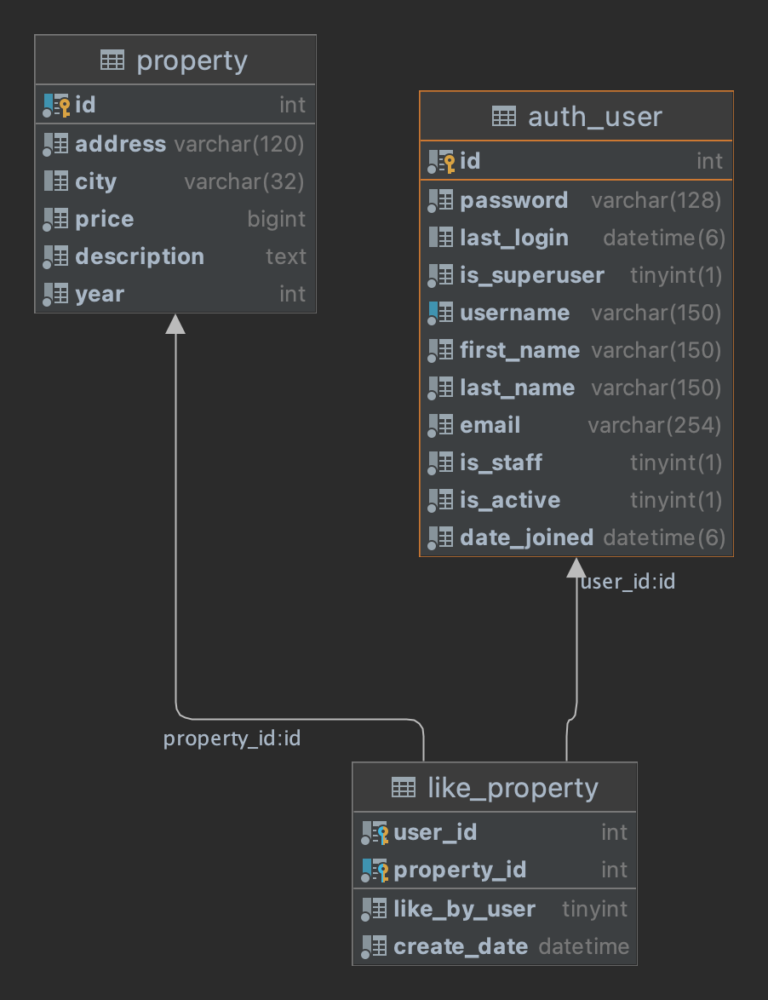

# habi-test

- [Primer Requerimiento (Api-Rest)](#primerpunto)
- [Segundo Requerimiento (ER-Diagram)](#segundopunto)

# PrimerPunto

- Tecnologias Utilizadas -> `Python 3.9`

### Dudas
1. Crear una API Rest sin framework para el microservicio de consulta de inmuebles.
   1. Si la api no tiene ningun query de filtro, debe retornar todos los inmuebles con los estados “pre_venta”, “en_venta” y
“vendido”
   2. La Api debe retornar la data segun los filtros.
2. Al no poder usar Flask/Django: crear el api rest usando solo python y las librerias de http.
3. Al no poder usar un ORM:  crear la conexion y filtrado directamente. 
4. Usar TDD para cada metodo/funcion.

## Como ejecutar? 

1. Agregar los datos faltantes de la conexion en 
el archivo `database/connect_db.py` en la funcion `conn_db` como la siguiente:
   ```python
   db_connection = connect(
            host="localhost",
            port="3309",
            user="pruebas",
            passwd="",
            database="habi_db")
   ```
2. Instalar las librerias necesarias del archivo requirements.txt con el comando:
   ```bash
   pip install -r requirements.txt 
   ```
3. Ejecutar el script app.py
   ```bash
   python app.py
   ```
4. Para Salir usar: `ctrl + c`

### Json de ejemplo del "front". 
* POST
* URL: `localhost:8081/habi`
```json
{
  "filters": {
    "city": "pereira",
    "status": "pre_venta",
    "year": 2020
  }
}
```

### Ejemplos de requests:
- Todos los filtros
```json
{
  "filters": {
    "city": "pereira",
    "status": "pre_venta",
    "year": 2020
  }
}
```

- Un filtro
```json
{
  "filters": {
    "year": 2020
  }
}
```

- Todas las propiedades [Sin Filtros]
```json
{
  "filters": {
  }
}
```

Nota: en el archivo `api-requests.http` hay mas ejemplos de peticiones a la API.
# SegundoPunto

## Funcionalidad Me Gusta. 
- Para soportar me gusta en el modelo E-R se debe agregar 
una entidad debil que guarde los likes de los usuarios a las propiedades

## Modelo - ER Propuesto:


### Descripcion:
La entidad like_propery, puede contener la informacion necesaria de si un usuario 
le dio "me gusta" a una propiedad, y tambien soporta si el usuario 
dio disklike "quitar me gusta", esto con la columna `like_by_user`. 

## SQL del modelo.
- Nota: Solo es necesario agregar la tabla debil y agregar las foreign-keys correspondientes.

```sql
create table like_property (
  user_id int(11) not null,
  property_id int(11) not null,
  like_by_user tinyint(4) not null default '1',
  create_date datetime not null default current_timestamp,
  primary key (`user_id`,`property_id`),
  key `fk_user_has_property` (`property_id`),
  constraint `fk_user_has_property1` 
      foreign key (`property_id`) references `property` (`id`) on delete no action on update no action,
  constraint `fk_user_has_property_user1` 
      foreign key (`user_id`) references `auth_user` (`id`) on delete no action on update no action
) ;
```